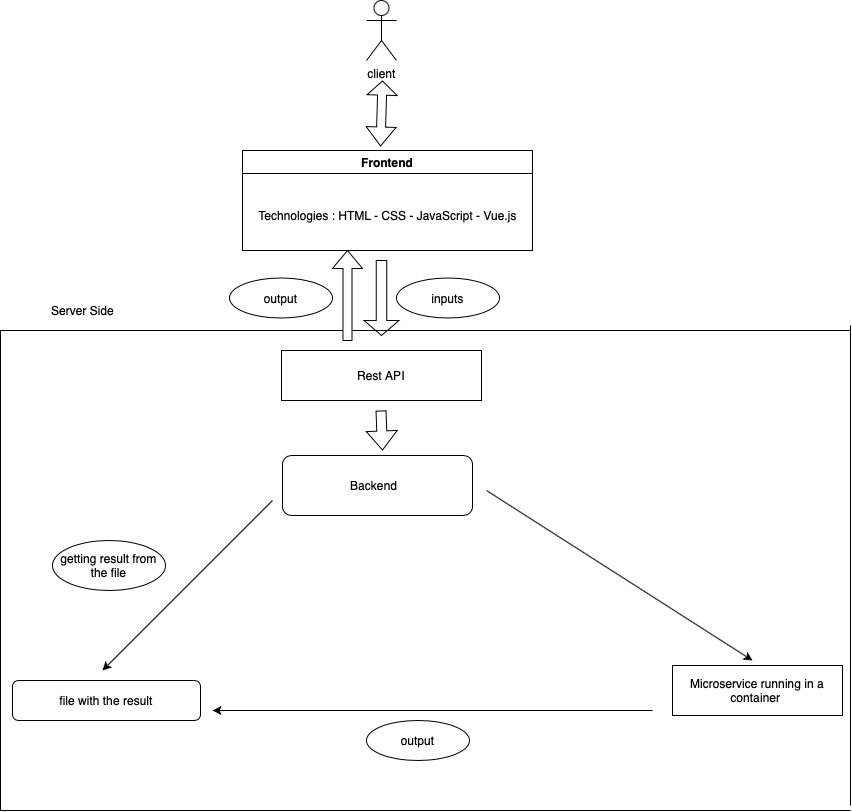

# Installation

Copy the folder in the vm:

```
 scp -r web-thermo/ YOUR_VM:~
```
or connect to your vm and:
```
git clone https://github.com/Voyinno/web-thermo.git
```

Connect to your VM and install docker:

```
sudo bash web-thermo/install.sh
```

To start the containers, go to the folder `web-thermo/` and do:

```
docker compose up
```

Make sure that you have the necessary environment files in their respective locations:

- One `.env` file in `ms-smith-python`
- One `.env` file in `backend_django`
- One `.env` file in `db`

The first time you launch application, you will have to populate the database, to do so, you will have to execute these commands in the folder where `docker-compose.yml` is located

```
docker compose exec backend_django python manage.py migrate
docker compose exec backend_django python manage.py load_component_data
```

You can now access the django app by using your vm address.


# Explanation

The application is composed of 4 containers:

- `nginx`
- `backend_django`
- `ms-smith-python`
- `db`

Each container has its own `Dockerfile` that is used to build the container.

The `docker-compose.yml` file is used to define the containers and their dependencies.

The `nginx` container is used as a proxy for the `backend_django` container. It is used to serve static files and to redirect requests to the `backend_django` container.

The `backend_django` container is the django app. It serves the html pages and the api requests.

The `ms-smith-python` container is the python microservice that does the diagram calculation.

The `nginx` container is defined as follows:

```yml
nginx:
  build:
    context: ./nginx/
  volumes:
    - static:/app/static/
  ports:
    - 80:80
  depends_on:
    - backend_django
  networks:
    - django_network
```

It is built from the `Dockerfile` in the `nginx` folder.
It is exposed on port `80`.

The `backend_django` container is defined as follows:

```yml
backend_django:
  build:
    context: ./backend_django/
  command: gunicorn backend_django.wsgi:application --bind 0.0.0.0:8000
  volumes:
    - ./backend_django/:/app/
    - static:/app/static/
  expose:
    - 8000
  depends_on:
    - db
  networks:
    - django_network
```

It is built from the `Dockerfile` in the `backend_django` folder.
It is exposed internally in the `django_network` on port `8000`.
It depends on the `db` container.

The `ms-smith-python` container is defined as follows:

```yml
ms-smith-python:
  build:
    context: ./ms-smith-python/
  command: uvicorn app.main:app --host 0.0.0.0 --port 5000
  expose:
    - 5000
  env_file:
    - ./ms-smith-python/.env
  networks:
    - django_network
```

It is built from the `Dockerfile` in the `ms-smith-python` folder.
It is exposed internally in the `django_network` on port `5000`.

The `db` container is defined as follows:

```yml
db:
  image: postgres
  volumes:
    - postgres_data:/var/lib/postgresql/data/
  env_file:
    - ./db/.env
  networks:
    - django_network
```

It is built from the `postgres` image.
It is exposed internally in the `django_network` on port `5432`.

The `networks` section defines the networks used by the containers.

```yml
networks:
  django_network:
    name: django_network
```

The `volumes` section defines the volumes used by the containers. The `static` volume is used by the `nginx` and `backend_django` containers. The `postgres_data` volume is used by the `db` container. This allows the data to persist between container restarts.

```yml
volumes:
  static:
    name: static
  db_data:
    name: db_data
```


# Architecture




# Switch microservice from python to julia

To switch the microservice from python to julia, you will have to use the `julia` image instead of the `python` image in the `docker-compose.yml` file.

This means that you have to uncomment the following lines:

```yml
  ms-smith-julia:
    build:
      context: ./ms-smith-julia/
    command: julia main.jl # le port est défini dans le fichier main.jl
    expose:
      - 5000
    networks:
      - django_network
```

and comment the following lines:

```yml
  ms-smith-python:
    build:
      context: ./ms-smith-python/
    command: uvicorn app.main:app --host 0.0.0.0 --port 5000
    expose:
      - 5000
    env_file:
      - ./ms-smith-python/.env
    networks:
      - django_network
```

You will also have to change the following line in `backend_django/.env` from `MS_ENDPOINT=ms-smith-python` to `MS_ENDPOINT=ms-smith-julia`.
