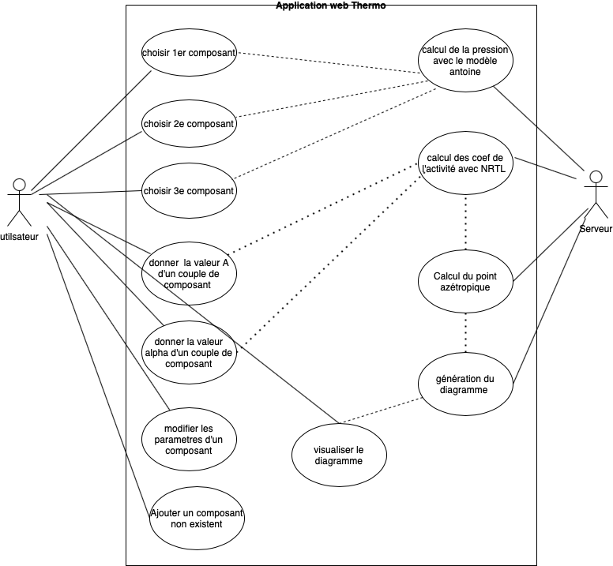

# User story

1. En tant qu'utilisateur, je souhaite bénéficier d'une interface graphique soignée et performante pour une expérience utilisateur agréable.
2. En tant qu'utilisateur, je dois être capable de choisir trois composants parmis la liste afin de définir le mélange pour lancer le calcul.
3. En tant qu'utilisateur final, je veux visualiser un diagramme thermodynamique modélisant l’interaction entre trois constituants d’un mélange apres la selection des composants.
4. En tant qu'utilisateur, je peux également ajouter un composant absent de la liste predefinie pour le calcul de la pression avec le modele Antoine et qui sera disponible dans la session ouverte, pour une personnalisation accrue de mon modèle.
5. En tant qu'utilisateur final, je peux également modifier/supprimer un composant.
6. En tant qu'utilisateur, je dois être capable de donner ou modifier des valeurs des coefficients des interactions binaire de chaque couple du triplet des composants choisis afin de pouvoir faire le calcul nrtl.
7. En tant qu'utilisateur, je veux savoir si les points sur les bords du triangle sont azétropique ou non.
8. En tant qu'utilisateur, je peux choisir la forme du diagramme soit triangle rectangle ou triangle equilaterale
9. En tant qu'utilisateur,  je veux visualiser les temperatures des points sur le bord du triangle.

# Use case

# Architecture

